# Django Serveless POC 
 
This is a practical guide to how deploy your django apps in AWS using a serveless approche.

All the infrastructre is developed using [Terraform](https://www.terraform.io/) and [Terragrunt](https://terragrunt.gruntwork.io/), also we use [Localstack](https://www.localstack.cloud/) to test locally.

## Requirements(Only tested in Linux )
- [Docker](https://docs.docker.com/engine/install/) 

- [DockerCompose](https://docs.docker.com/compose/install/)

- [Terraform](https://developer.hashicorp.com/terraform/tutorials/aws-get-started/install-cli)

- [Terragrunt](https://terragrunt.gruntwork.io/docs/getting-started/install/)

- [LocalstackPro](https://docs.localstack.cloud/getting-started/installation/#docker-compose) (Create a trial account(14 days free), then get the token from the [website](https://docs.localstack.cloud/getting-started/auth-token/) and put in your envs machine like **LOCALSTACK_AUTH_TOKEN**)

- [Make](https://www.incredibuild.com/integrations/gnu-make)

## Architecture

<div align="center">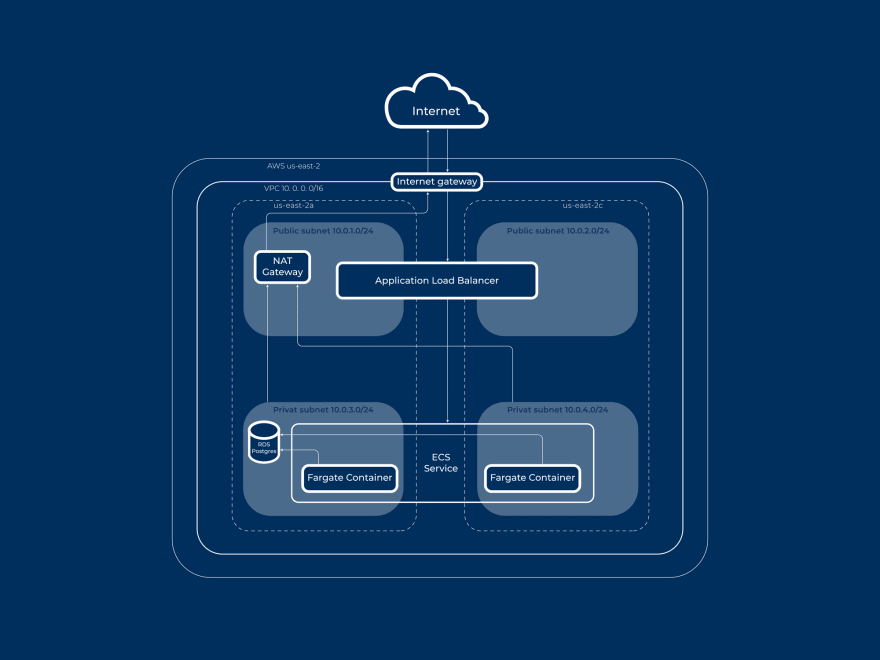</div>

- **VPC**: as a virtual networking environment:
    - **Public and Private subnets**: in different avaliability zones
    - Routing tables
    - **Internet gateway**: for internet access for public subnets
    - **NAT gateway**: for internet access for private subnets
- **ECR**: Docker images container registry.
- **ECS + Fargate**: to run docker containers serverless:
    - ECS Cluster
    - ECS Task definition
    - **ECS Service**: to run tasks with the specified definition in the ECS cluster
    - **IAM Roles and Policies**: to allow tasks access to resources
- **EC2 Application load balancer**: for traffic routing:
    - **LB listener**: to receive the incoming HTTP requests
    - **LB Target group**: to route requests to the Django application
    - **Security groups**: to control incoming traffic to LB
- **IAM**: for managing AWS permissions.
- **CloudWatch**: for logs and metrics using a group and stream.

## How do it works?
1. We define all the infrastructure in our Terraform files(.tf), Terraform connects with our AWS account using the **aws_access_key_id** and the **aws_secret_access_key** and create, delete or update the resources for as automatically using the **terraform apply** command.

2. Terragrunt allows as define dinamically the evironments using the function **path_relative_to_include()** getting the specific settings from **terraform/environments/N/terragrunt.hcl**.

3. For this POC we connect our Terraform with Localstack to simulate the deploy locally, with this we can test the deploy without fear to broke real environments or generate bills in our AWS account.

## How to run the POC?
```console
[ROOT]$ make run_poc
```

### what expected after ran the POC?

1. The terraform resources added and modified:

<div align="center">
    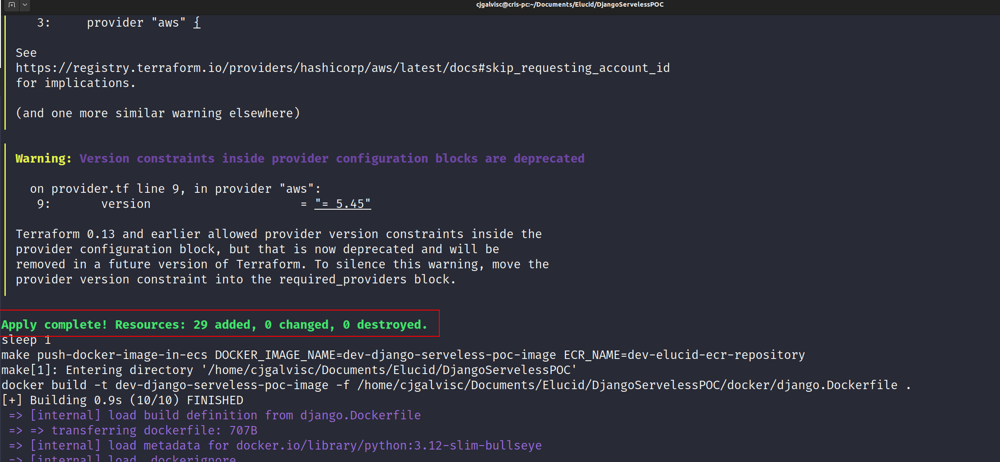
    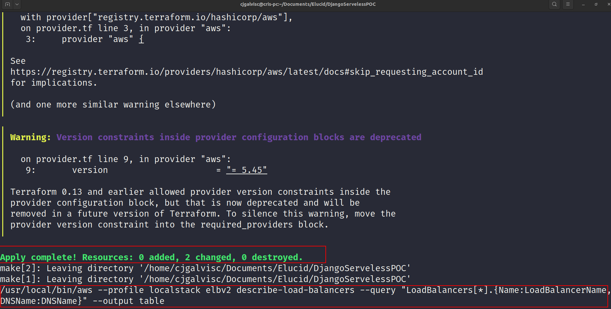
</div>

2. The Load Balancer Domain(DNS) to access from the browser or any HTTP client

<div align="center">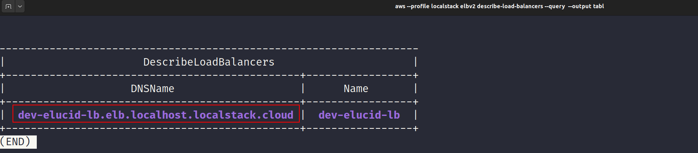</div>


### How to verify the results?

1. Check the Localstack Terminal Logs

```console
[ROOT]$ make localstack-pro-logs
```

<div align="center">
    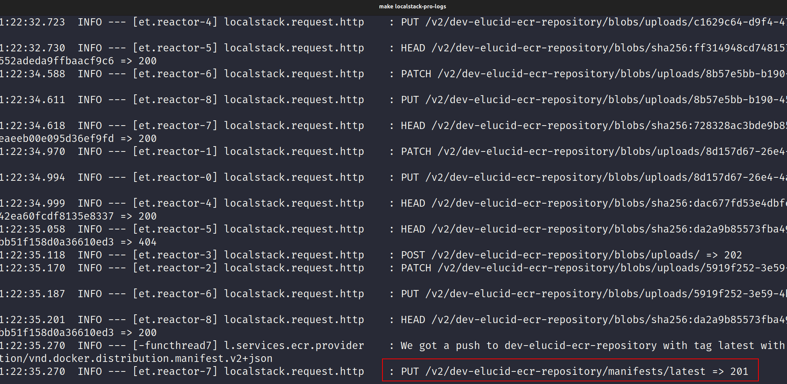
</div>

2. Check the Localstack Web Logs

<div align="center">
    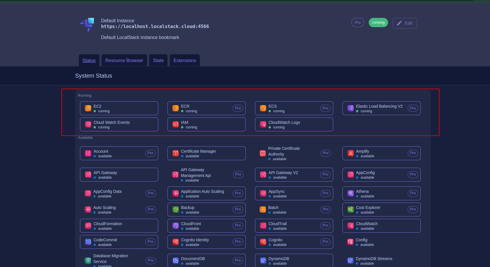
    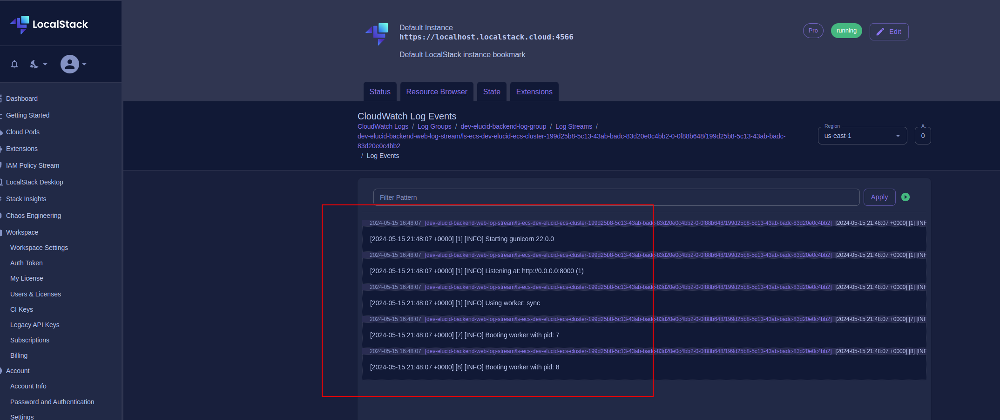
</div>

3. Open the Load Balancer DNS(http://dev-elucid-lb.elb.localhost.localstack.cloud:4566) in the browser or HTTP client

<div align="center">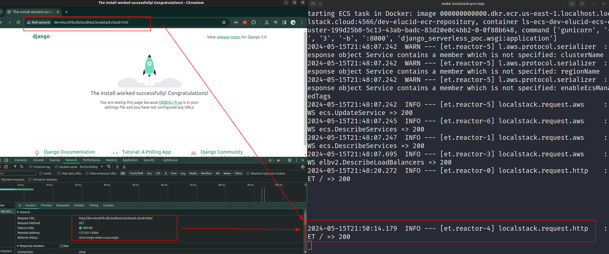</div>


4. Open the admin panel http://dev-elucid-lb.elb.localhost.localstack.cloud:4566/admin (the css styles doesn't work because is missing add the S3 bucked to store static file)

<div align="center">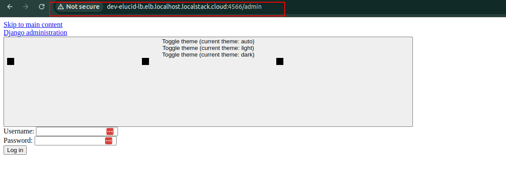</div>


### Others

#### How to check all the POC commands ?
```console
[ROOT]$ make
```
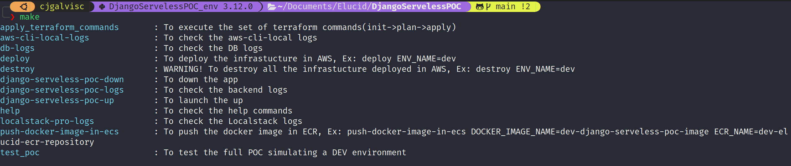

### What is missing?
1. Add these real deploy pieces:
    - **Certificate Manager**: for SSL certificate.
    - **Route53**: for DNS management(connect a hosting like Namechap domain to Route53 DNS zone).
    - **RDS**: Postgresql as DB.

        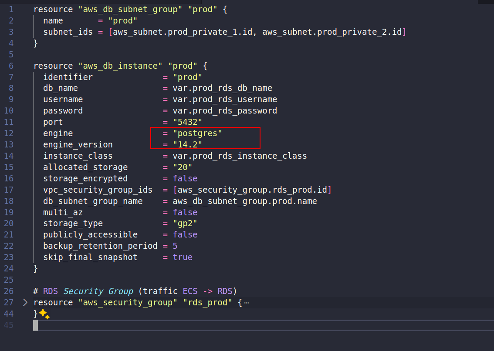

    - **S3**: as storage for media files(to allow css styles and html).
    - **SQS**: as Celery and Celery Beat worker backend:

        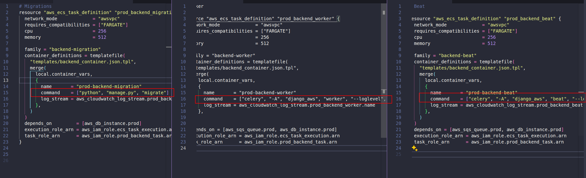

    - **ECS Autoscaling configuration**: to set the ability to increase or decrease the number of running instances automatically(the real serverless).

        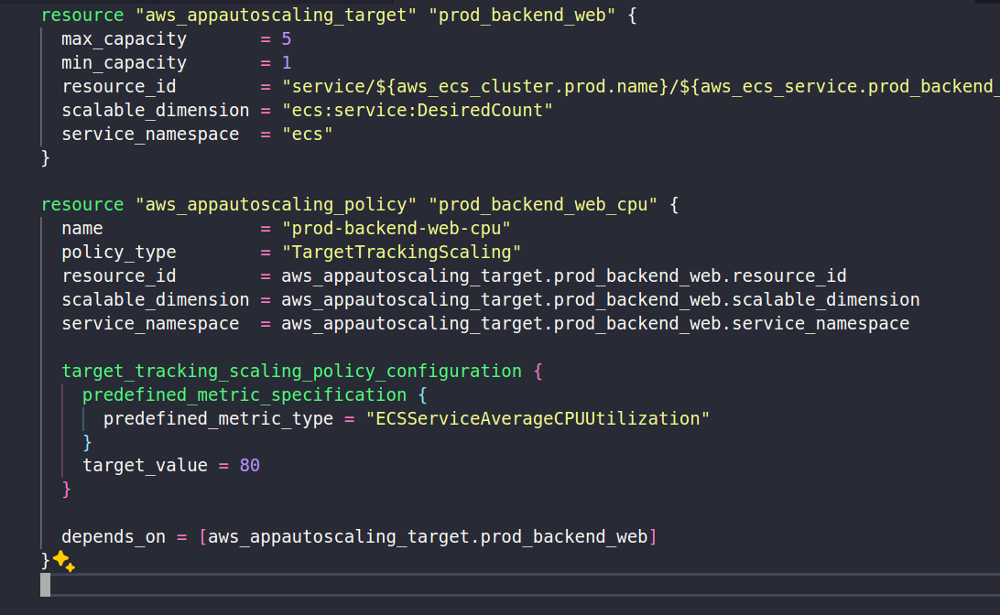

2. **The CI/CD implementation(github actions)**: to generate automatic deploys.
3. Add this setup to the root/terragrunt.hcl to allow save the tfstates dynamically:
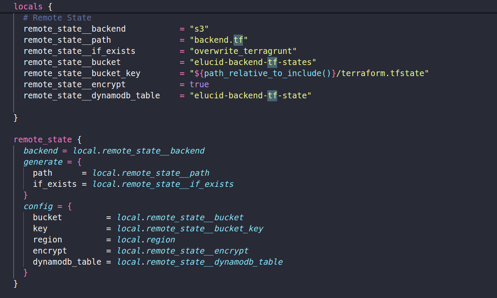

### Resources
This POC was developed following this [guide](https://dev.to/daiquiri_team/deploying-django-application-on-aws-with-terraform-minimal-working-setup-587g)